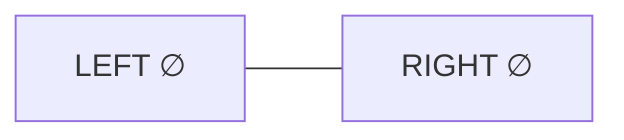
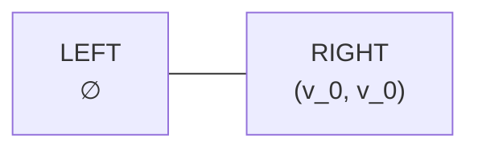
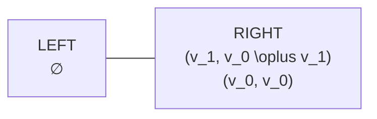
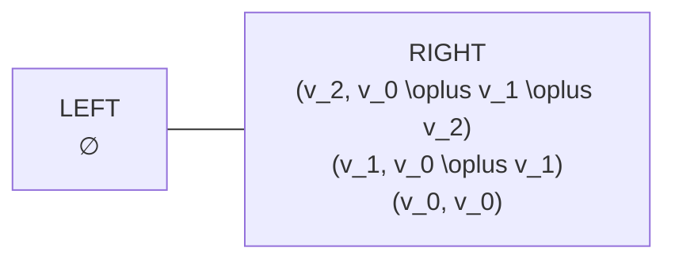
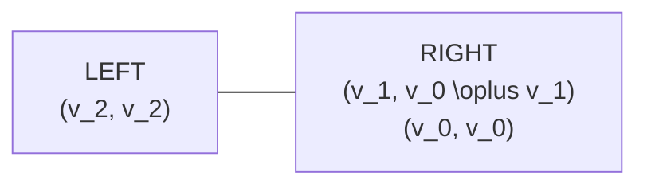
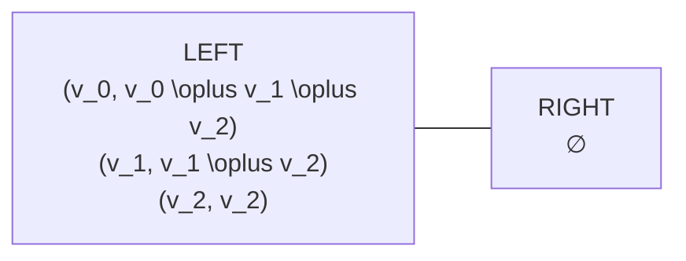
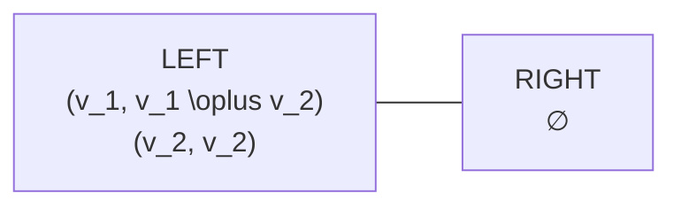
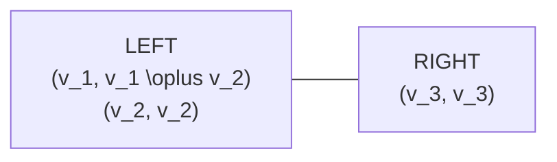

# DABA

The last two posts catered a decreasing order of convenient operators- abelian groups, groups... and now monoids.

So, if you are dealing with the former two, skip this. You have a good life. This is about the neglected child of algebra- the monoids (just kidding, it has got plenty of attention as you will see)

## The problem (and no, it is not aggregation)

As we said- "Sliding window aggregation is **not** about aggregation.""

It is about **deletion**.

Insertion is quick.  
Query is quick.  

Deletion is where things break.

We have a window:

$$
\langle v_0, v_1, v_2, v_3, v_4 \rangle
$$


And an operator $\oplus$.

Associative.  
Nothing else promised. Especially not an inverse.

You want this

$$
v_0 \oplus v_1 \oplus v_2 \oplus v_3 \oplus v_4
$$

You will, because you can. What you cannot, is easily integrate the next element $v_5$, into a window of size 5.

you will add this new element to the right. And then you would like to get rid of $v_0$ from the left. And... you cannot because there is no inverse.

You dearly want this

But you cannot from the aggregate you have constructed.

$$
v_1 \oplus v_2 \oplus v_3 \oplus v_4
$$

## Insertion is constant (and forever solved)

Let’s get this out of the way.

Insertion is **trivial**.

A new element $v_5$ arrives on the right.

You already have:

$$
v_0 \oplus v_1 \oplus v_2 \oplus v_3 \oplus v_4
$$

You just do:

$$
(v_0 \oplus v_1 \oplus v_2 \oplus v_3 \oplus v_4) \oplus v_5
$$

Done.

$O(1)$.  
Always.  
No caveats.  
No tricks.  

This will never be the problem.  
If anyone tells you otherwise, they are lying or confused.

So we move on.

---

## The naive eviction strategy (aka recompute like it’s 1995)

Now the window slides.

$v_0$ leaves.

You want:

$$
v_1 \oplus v_2 \oplus v_3 \oplus v_4 \oplus v_5
$$

What do you do?

You keep all elements around.
You scan them.
You recompute the aggregate from scratch.

Every.  
Single.  
Time.

Cost?

$$
O(n) \text{ per eviction}
$$

Correct? Yes.  
Efficient? No.  
Interesting? Also no.

But this baseline matters, because everything else is trying to beat *this*.

---

## A better eviction (and a worse insertion)

At this point, a reasonable thought appears:

> “What if I precompute more stuff?”

Specifically, suffix aggregates.

Instead of keeping just one aggregate, you keep:

$$
\begin{aligned}
&v_0 \oplus v_1 \oplus v_2 \oplus v_3 \oplus v_4 \\
&v_1 \oplus v_2 \oplus v_3 \oplus v_4 \\
&v_2 \oplus v_3 \oplus v_4 \\
&\dots
\end{aligned}
$$

Now eviction is easy.

$v_0$ leaves?  
Just drop the first line.

$O(1)$ eviction.  
Life looks good.

But then a new element arrives.

$v_5$ shows up.

Every single suffix must be updated to include $v_5$.

That is:

$$
O(n) \text{ per insertion}
$$

Congratulations.

You have simply moved the pain.

---

## The Pareto frontier (you cannot escape this)

This is the first hard wall you hit.

You can have:

- $O(1)$ insertion and $O(n)$ eviction  
**or**
- $O(1)$ eviction and $O(n)$ insertion  

Pick one.

There is no clever bookkeeping that avoids this.
This is not a data-structure limitation.
This is an **information limitation**.

Deletion destroys information.
Without an inverse, you pay somewhere.

Every algorithm from here on is about **where** and **when** you pay.
Not **whether** you pay.


- RIGHT: where new elements are inserted  
- LEFT: where old elements are evicted from  

Each side stores **prefix aggregates** of its own elements.

Insertion:
- push into RIGHT
- update RIGHT’s prefix aggregate
- $O(1)$

Eviction:
- pop from LEFT
- $O(1)$

Query:
- combine the two aggregates
- $Agg(LEFT) \oplus Agg(RIGHT)$
- $O(1)$

So far, this looks perfect.

---

## The reversal (and where everything goes sideways)

Eventually, LEFT becomes empty.

But RIGHT still has elements.
And eviction must continue.

So RIGHT must now become the new LEFT.

But LEFT requires elements in **reverse order**  
with **fresh prefix aggregates**.

So we do the only possible thing:

- pop everything from RIGHT
- push into LEFT
- recompute prefix aggregates along the way

Formally correct.
Logically sound.
Mathematically inevitable.

And costs:

$$
\Theta(n)
$$

in **one single operation**.

---

## The latency spike

This is the price two-stacks pays.

Most operations are cheap.
Then suddenly —
boom —
a full reversal.

No warning.
No gradual buildup.
Just a cliff.

Average time looks great.
Tail latency is catastrophic.

If you care about real-time systems,
or predictable latency,
this is unacceptable.

And this is not a bug.
This is the algorithm doing exactly what it promised.

---

## What actually went wrong (hint: nothing broke)

Two-stacks is not stupid.
It is not naive.
It is not poorly implemented.

It made one very specific choice:

> “I will delay the unavoidable work  
> until the last possible moment.”

And that choice is the entire problem.

The work is real.
The work must be done.
But doing it **all at once** is the mistake.

Everything from here on is about fixing *that*.
Nothing else.

## Two-stacks in motion (no hand-waving)

Before moving on, it helps to **see two-stacks actually run**.
No abstractions. No shortcuts. Just state transitions.

We maintain two stacks:

* `LEFT`  → eviction happens here
* `RIGHT` → insertion happens here

Each stack stores **(value, prefix-aggregate-from-top)**.


### Initial state



### Insert $v_0$

Insertion always goes to `RIGHT`.



Aggregate: $v_0$

### Insert $v_1$



Aggregate: $v_0 \oplus v_1$

### Insert $v_2$



Aggregate: $v_0 \oplus v_1 \oplus v_2$

### Evict (LEFT is empty → rebuild)

Eviction must remove the oldest element, but `LEFT` is empty.
So we **reverse RIGHT into LEFT**, rebuilding prefix aggregates.

This entire sequence happens in **one operation**.

### Step 1 — move $v_2$



### Step 2 — move $v_1$


### Step 3 — move $v_0$



This whole rebuild is $\Theta(n)$ work in a *single* operation.


### Evict $v_0$



Aggregate:$v_1 \oplus v_2$

### Insert $v_3$



Aggregate:$(v_1 \oplus v_2) \oplus v_3$

### The important observation

Two-stacks behaves like this:

* Do **nothing** while `RIGHT` fills
* Then do **everything** when `LEFT` empties

Correct aggregates. Correct FIFO order.

The **timing** is the bug.
Not the idea.

## The real problem is not the work — it is *when* the work happens

Let’s pause and be very clear.

Two-stacks is **correct**.  
The aggregates are correct.  
The eviction order is correct.  
The math is correct.

Nothing is broken.

So why are we unhappy?

Because two-stacks makes one very specific choice:

> “I will delay the unavoidable work  
> until the last possible moment.”

That is it.  
That is the entire bug.

---

### The work is inevitable

At some point, RIGHT must be reversed into LEFT.

There is no trick that avoids this.
There is no clever algebra hiding here.
This is forced by:
- FIFO eviction
- non-invertibility
- prefix aggregates

So the cost exists.
The only freedom you have is **scheduling**.

---

### Two-stacks chooses the worst possible schedule

Two-stacks behaves like this:

- While RIGHT fills → do nothing  
- When LEFT empties → panic  

All the work is compressed into one operation.

Which means:
- average cost looks great
- worst-case cost is terrible
- tail latency explodes

If you care about predictable latency,
this is unacceptable.

---

### The forbidden thought (that turns out to be correct)

At this point, a dangerous idea appears:

> “What if I don’t wait?”

What if:
- I start reversing RIGHT *before* LEFT is empty
- I do a **tiny amount of work** every operation
- so that when eviction is needed, everything is ready

This feels obvious in hindsight.
It is also exactly what two-stacks refuses to do.

---

### Why this is *not* amortization

This part matters.

Amortization says:

> “Over many operations, the average cost is small.”

That is not enough.

Here we want:

> “Every single operation is bounded.”

No spikes.
No special cases.
No ‘except once in a while’.

So the idea is not:
- do nothing, then do a lot  
but:
- do a little, every time  

This is **worst-case $O(1)$**, not amortized $O(1)$.

Different promise.
Stronger promise.

---

### So what stops us?

At this point you might ask:

> “Why didn’t we just do this from the start?”

Because incremental reversal creates a new problem.

A subtle one.
And a serious one.

If you reverse gradually,
you end up in a **mixed state**.

Some elements are:
- already reversed
- but not old enough to evict

Some elements are:
- still unreversed
- but older

FIFO order is now at risk.

You cannot evict the wrong element.
Ever.

This is the *actual* hard problem.

And this is where DABA begins.

## Incremental reversal breaks FIFO — unless you separate safe from unsafe

Up to now, the plan sounded simple.

Do the work early.
Do a little reversal every operation.

And yes — this *does* fix the latency spike.

But it immediately breaks correctness.


### Where FIFO actually breaks

Suppose the window is:

$$
\langle v_0, v_1, v_2, v_3 \rangle
$$

You start incremental reversal.

First move $v_3$.
Then move $v_2$.

Physically, things now look like:

```
[ v_2, v_3 | v_0, v_1 ]
```

But logically, eviction order is still:

$$
v_0 \rightarrow v_1 \rightarrow v_2 \rightarrow v_3
$$

Here is the bug:

$v_2$ and $v_3$ *look* ready.
But they are not the oldest.

Evicting them now would be wrong.

This is not a performance issue.
This is a correctness violation.


### Reversed does not mean evictable

This is the key mental shift.

Being reversed is **not enough**.

An element must satisfy **two** conditions:

* it is reversed
* **no older element exists anywhere**

Only then may it be evicted.

So we need a new concept.

Not “reversed”.

But **safe**.


### Safety (defined precisely)

An element is **safe** iff:

> there exists no element older than it
> anywhere in the data structure

That’s it.

No timing assumptions.
No heuristics.
No guesses.

If something older exists —
this element is **unsafe**.


### Why this forces a three-way split

During incremental reversal, elements now fall into exactly three classes:

1. **Safe**
Reversed and old enough. May be evicted.

2. **Unsafe**
Reversed, but something older still exists.

3. **Unprocessed**
Still in original insertion order.

Eviction has a single rule:

> remove from **safe only**

Anything else breaks FIFO.


### The only valid logical layout

Once you accept all of the above, the window must look like:

```
[ SAFE | UNSAFE | UNPROCESSED ]
```

With strict rules:

* eviction → SAFE only
* insertion → UNPROCESSED only
* reversal → UNPROCESSED → UNSAFE
* promotion → UNSAFE → SAFE (only when allowed)

This structure is not a design choice.

It is forced by:

* incremental reversal
* FIFO eviction
* non-invertible operators

### One sentence to lock in

Incremental reversal is easy.

**Correct** incremental reversal requires knowing what is safe.

Everything that follows is just making this executable in worst-case $O(1)$.

## DABA — the three-split deque that never panics

Now everything is in place.

We know:

* deletion is the enemy
* inversion is unavailable
* recomputation is inevitable
* delaying work causes spikes
* incremental reversal breaks FIFO unless we track safety

So what is left is not *whether* to do the work.
It is *how* to schedule it.

This is DABA.

### The core idea (no fluff)

DABA makes one decision.

> **Never finish anything.**

No rebuild phase.
No normal mode.
No panic moment.

The system is *always* mid-reversal.

Every operation:

* does its main job (insert or evict)
* does a tiny, fixed amount of reversal work

Nothing more.
Nothing less.

### The only structure that can work

From the previous section, the window must look like:

```
[ SAFE | UNSAFE | UNPROCESSED ]
```

This is not optional.
This is forced.

Each region has one job:

* **SAFE**
  Old enough. Reversed. Evictable.

* **UNSAFE**
  Reversed, but something older still exists.

* **UNPROCESSED**
  Fresh inserts. Original order.

Eviction touches **SAFE only**.
Insertion touches **UNPROCESSED only**.

### What happens on each operation

Every operation is allowed to do **constant work**.

That budget is spent like this:

* **Insert**
  append element to UNPROCESSED

* **Evict**
  remove element from SAFE

* **Reversal step** (always attempted)
  move one element from the *right end* of UNPROCESSED
  to the *left end* of UNSAFE

If UNPROCESSED is empty, no reversal step happens.

### Promotion (the quiet boundary shift)

There is exactly one moment when regions change roles.

When:

$$
UNPROCESSED = \varnothing
$$

then:

```
UNSAFE → SAFE
```

This is **not** a rebuild.
This is **not** a loop.

It is a pointer move.
$O(1)$.

At this moment, every element in UNSAFE is now:

* reversed
* and older than everything else

So they are safe.

### Aggregates (why this still works)

Each region maintains its own aggregate:

* $Agg(SAFE)$
* $Agg(UNSAFE)$
* $Agg(UNPROCESSED)$

The window aggregate is always:

$$
Agg(SAFE) \oplus Agg(UNSAFE) \oplus Agg(UNPROCESSED)
$$

No scanning.
No recomputation.
No surprises.

Each move updates aggregates in $O(1)$.

### Why new inserts do not break anything

Yes — new elements can arrive
*while* reversal is happening.

That is expected.

New inserts always go to UNPROCESSED.
Reversal always pulls from the *right end* of UNPROCESSED.

So older elements are always reversed
before newer ones can become evictable.

FIFO order is preserved.

### Why this is worst-case $O(1)$ (not amortized)

There is no hidden loop.
There is no deferred rebuild.

Each operation performs:

* one insert *or* one evict
* at most one reversal move
* a constant number of $\oplus$ operations

That is it.

Worst-case.
Every time.


### What DABA actually fixes

Two-stacks:

> do nothing → panic → recover

DABA:

> do a little → do a little → do a little → always ready

Same total work.
Different schedule.

That difference *is* the paper.

### One sentence to remember

DABA is not an aggregation algorithm.

It is a **work-scheduling algorithm**
for deletion under non-invertible algebraic constraints.

And there you have it, an efficent operator for your monoid operations.