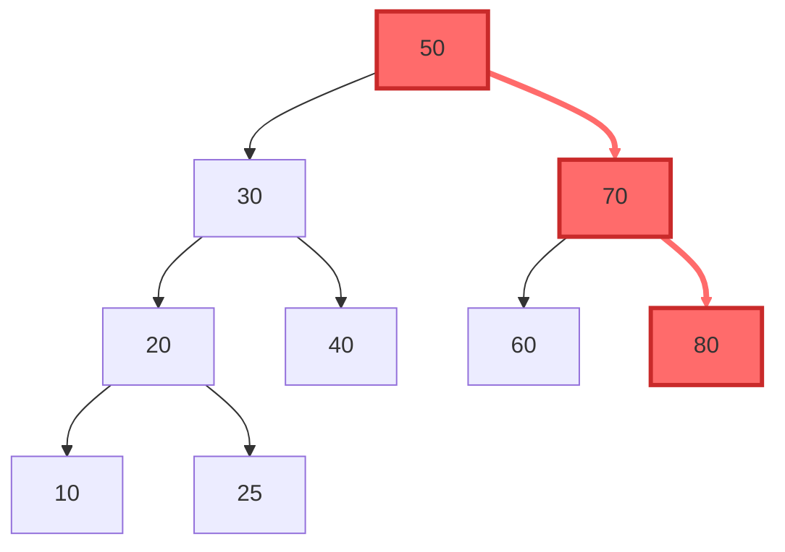
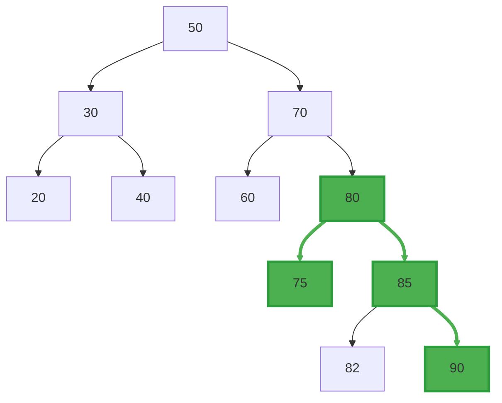

# FiBA

Most people think sliding window aggregation is about aggregation.
It is **NOT**.

It is far more about deletions... atleast the efficient implementations.

---
## Ordered Events  $\equiv$  Good life
For the most times, we have paned slices from previous windows. When a new data comes in, the data at the oldest edges are popped a.k.a. deleted, the new data is pushed and added.

Now think about how this works.
Deletion works only if we can invert the operation. If the operation is an abelian group, you have the best life ever. You can skip this paper (seriously..). Thank you.

If you do not, you still have hope if the operator is a group. There is not much difference in the complexity compared to the abelian group implementation. Both will clock $\mathcal{O}(1)$ insertion and eviction from the previous window. 

Operations without associativity, though, well you have a slim hope, before you can skip this paper too (i.e. you will have to aggregate over the whole window every time)

> Find an $\mathcal{O}(log n)$ way to use monoid or abelian group operations to derive the non-associative operation. Then you can very well benefit from FiBA. For example: $avg(sum, count)$. Sum and Count are both abelian operationss. And average can be derived from them in $\mathcal{O}(1)$. Despite average itself being a non-associative operation.

## Unordered Events $\equiv$ Sad life

Life of group and monoid operations is not easy in the real-world, where we do not have ordered events.

Events being uordered mean that the following are not possible in constant time-
1) Finding where the new event belongs
2) Inserting into the aggregate
3) Eviction from the aggregate 

All algorithms for online insertion and updation have well-known data structures (like augmented balanced binary trees) that make them possible.
All exhibit $\mathcal{O}(log n)$ complexity.

That is what most implementations prior to FiBA used.

---

Now, honestly speaking we cannot do much better than these. The algorithms for online queries of monoid aggregates have been studied for centuries much before streaming systems.
Logarithmic complexity was the best we could muster.

FiBA does **not** fight this fact.

FiBA asks a different question.

> Can we be a little biased?  
>  
> Can we reduce the cost for the kind of updates that happen **more often** in streaming systems — near the window boundaries — and pay more only when the data is *really* out of order?

This is where the idea of **out-of-order distance** sneaks in.

---

## Finding where the new event belongs- Finger Search

Take a look at how we usually find the index where the insertion/eviction must happen...
We start at the root. Then we do a binary divide and conquer, till we reach where we need.

This is kind of wasteful, especially for streaming.

Why?

Because in streams:
- most events arrive close to “now”
- evictions almost always happen at the left boundary
- deep out-of-order events are rare

Yet, the data structure treats *every insertion as equally hard*.

---

## The Finger Search idea

Instead of always starting from the root, FiBA maintains **fingers** — pointers — to the leftmost and rightmost leaves of the tree.

So now, when a new event arrives:
- if it belongs near the right boundary, we start from the right finger
- if it belongs near the left boundary, we start from the left finger

We walk **up** the tree only as much as required, and then descend if needed.

The cost now depends on how far the event is from the nearest boundary.

This distance is called:

$$
d = \text{out-of-order-distance}
$$

And the search cost becomes:

$$
\mathcal{O}(\log d)
$$

---

When the stream is almost ordered, $d$ is small.  
When the stream is perfectly ordered, $d = 0$.  
And we get **$\mathcal{O}(1)$** behavior.

So far, so good.

But search is only half the problem.

---

## The real enemy: maintaining aggregates

Finding where the event belongs is easy compared to what comes next.

After insertion or deletion, we must **repair the aggregates**.

In a traditional augmented tree:
- each node stores the aggregate of its subtree
- any update forces recomputation all the way to the root

So even if finger search gives us $\mathcal{O}(\log d)$ search,
aggregation repair still costs:

$$
\mathcal{O}(\log n)
$$

This is where most “finger tree + aggregate” ideas fail.

FiBA’s real contribution is not finger search.

It is how aggregation is stored.

---

## Position-aware partial aggregates

The key observation is subtle:

> Not all nodes need to know the *full* aggregate of their subtree.

In sliding windows:
- changes mostly happen near the left or right boundary
- interior nodes rarely change

So FiBA stores **different kinds of aggregates at different positions** in the tree:
- some nodes store full subtree aggregates
- some nodes intentionally exclude boundary children
- some nodes only care about one side

This allows aggregation repair to be confined to:
- the finger search path
- the rebalancing path (which is amortized constant)

The result is that **aggregate maintenance also costs $\mathcal{O}(\log d)$**.

This is the real magic.

---

## Rebalancing does not ruin everything

At this point, you might worry:

> “But B-trees rebalance. Splits and merges are expensive.”

Yes — but only if you rebalance eagerly.

FiBA uses **lazy rebalancing**:
- nodes are allowed to temporarily violate size constraints
- repairs are spread out over time

The authors prove that:
- structural rebalancing costs **$\mathcal{O}(1)$ amortized**
- aggregation repair dominates the complexity

So the final bound stands.

---

## Putting it all together

For out-of-order sliding window aggregation over a monoid:

- Search cost: $\mathcal{O}(\log d)$
- Aggregate repair: $\mathcal{O}(\log d)$
- Rebalancing: $\mathcal{O}(1)$ amortized
- Query whole window: $\mathcal{O}(1)$
- Space: $\mathcal{O}(n)$

And there is a matching lower bound:

$$
\Omega(\log d)
$$

Meaning: **this is optimal**.

---

## Final thought

FiBA does not magically make unordered streams easy.

What it does is more honest.

It acknowledges that:
- most disorder is small
- worst-case disorder is rare
- streaming systems should optimize for *reality*, not paranoia

If your operator is an abelian group, congratulations — go home.

If it is a monoid, and your stream is even slightly ordered, FiBA is the difference between “log n always” and “almost constant time”.

And that difference matters.

