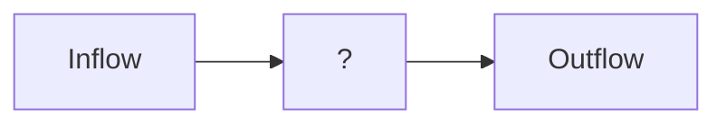

# The Millwheel Model

Millwheel was the first paper that effectively kicked off purely stream processing systems that are not some rendition of existing batch processing system, adapted to stream processing.

Below we discuss how Google worked out its streaming systems using a model that they named MillWheel, the practices of which still underlie systems like Apache Flink.

## The Inflow and the Outflow

Let us take a look at the problem system first. 

**Inflow** is a stream of tuples to be **processed**. The _processing_ could be a function. The function can take either just this timestep t_n, 
a window $\langle t_{n-w}, \dots, t_n \rangle$, or the entire history.

The incoming events can be
- Out-of-order
- Late 
- Repeated

**Outflow** is a generative stream, sunk anywhere pleased. At every interval of $s$, one must compute the function with the given arguments.s

We intend to make a setup that has to distributed, computation nodes that are independent; possibly hot-loaded onto a running job, and handle all the errors in the data.

We must provide an **Exactly once** semantics with **resilience**.

### Delivery Semantics
Delivery Semantics talk in detail about the disorder input streams bring in ordering. They do not talk about what state is correct, but about what may happen to an event while it is in flight, especially in the presence of failures. A streaming system typically exposes three such semantics:

1) **Exactly-once**
The strongest promise. Events may be retried, replayed, or reordered, but the system invests enough redundancy and coordination to ensure that their effects are applied exactly once.
2) **At-least-once**
A weaker but cheaper guarantee. Events are never lost, but may be delivered multiple times. Handling duplicates is pushed to the operator or sink.
3) **At-most-once**
The weakest and cheapest option. Events are delivered at most once, with no retries. Failures may lead to data loss, but overhead is minimal.

They are ordered deliberately: from maximum redundancy and safety to minimum overhead and best-effort delivery.

## Desiderata

MillWheel defines a streaming system around a small but strict set of requirements,
motivated by unbounded data, stateful computation, and event-time semantics.

- **Low-latency data availability**  
  Data should be available to consumers as soon as it is published. There should be
  no system-intrinsic barriers to ingesting inputs and producing outputs.
- **Integrated persistent state**  
  Persistent state abstractions should be available to user code and must be
  integrated into the system’s overall consistency and recovery model.
- **Graceful handling of out-of-order data**  
  The system should correctly handle data that arrives out of order, rather than
  assuming ordered input streams.
- **System-managed low watermarks**  
  The system should compute a monotonically increasing low watermark over data
  timestamps, providing a notion of progress in unbounded streams.
- **Scalable latency**  
  Latency should remain stable as the system scales to more machines, instead of
  degrading with cluster size.
- **Exactly-once delivery**  
  The system should provide exactly-once delivery of records, even in the presence
  of failures.

## Low Watermarking

> We only deal with functions that are algebraic **Groups** over the tuples. Sure we could deal with non-associative operations, but with a clear impending cost
> in the attempt to manage the order of the incoming events.

Low Watermarking tell a computation node "you have received all nodes with timestamps lower than this watermark". It is the lower bound of the events a node has to expect in future.

Whenever a node receives this, it can run the aggregate on all the elements before this watermark.

The challenge is to how to determine this lower bound. So let us walk through this. What timestamp are we guaranteed to not receive an earlier event from? Who can tell that to us?

---
$$
\text{low watermark of A} = \min\{\text{oldest work of A}, \min{\{\text{low watermark of C}: \text{C output to A}\}}\}
$$

---