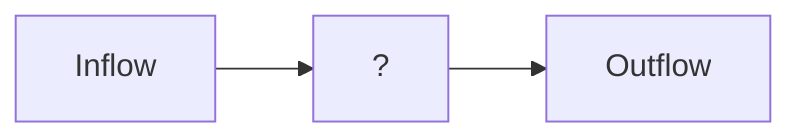

# The Millwheel Model

Millwheel was the first paper that effectively kicked off purely stream processing systems that are not some rendition of existing batch processing system, adapted to stream processing.

Below we discuss how Google worked out its streaming systems using a model that they named MillWheel, the practices of which still underlie systems like Apache Flink.

## The Inflow and the Outflow

Let us take a look at the problem system first. 

**Inflow** is a stream of tuples to be **processed**. The _processing_ could be a function. The function can take either just this timestep t_n, 
a window $\langle t_{n-w}, \dots, t_n \rangle$, or the entire history.

The incoming events can be
- Out-of-order
- Late 
- Repeated

**Outflow** is a generative stream, sunk anywhere pleased. At every interval of $s$, one must compute the function with the given arguments.s

We intend to make a setup that has to distributed, computation nodes that are independent; possibly hot-loaded onto a running job, and handle all the errors in the data.

We must provide an **Exactly once** semantics with **resilience**.

### Delivery Semantics
Delivery Semantics talk in detail about the disorder input streams bring in ordering. They do not talk about what state is correct, but about what may happen to an event while it is in flight, especially in the presence of failures. A streaming system typically exposes three such semantics:

1) **Exactly-once**
The strongest promise. Events may be retried, replayed, or reordered, but the system invests enough redundancy and coordination to ensure that their effects are applied exactly once.
2) **At-least-once**
A weaker but cheaper guarantee. Events are never lost, but may be delivered multiple times. Handling duplicates is pushed to the operator or sink.
3) **At-most-once**
The weakest and cheapest option. Events are delivered at most once, with no retries. Failures may lead to data loss, but overhead is minimal.

They are ordered deliberately: from maximum redundancy and safety to minimum overhead and best-effort delivery.

## Desiderata

MillWheel defines a streaming system around a small but strict set of requirements,
motivated by unbounded data, stateful computation, and event-time semantics.

- **Low-latency data availability**  
  Data should be available to consumers as soon as it is published. There should be
  no system-intrinsic barriers to ingesting inputs and producing outputs.
- **Integrated persistent state**  
  Persistent state abstractions should be available to user code and must be
  integrated into the system’s overall consistency and recovery model.
- **Graceful handling of out-of-order data**  
  The system should correctly handle data that arrives out of order, rather than
  assuming ordered input streams.
- **System-managed low watermarks**  
  The system should compute a monotonically increasing low watermark over data
  timestamps, providing a notion of progress in unbounded streams.
- **Scalable latency**  
  Latency should remain stable as the system scales to more machines, instead of
  degrading with cluster size.
- **Exactly-once delivery**  
  The system should provide exactly-once delivery of records, even in the presence
  of failures.

## Low Watermarking

> We only deal with functions that are algebraic **Groups** over the tuples. Sure we could deal with non-associative operations, but with a clear impending cost
> in the attempt to manage the order of the incoming events.

Low Watermarking tell a computation node "you have received all nodes with timestamps lower than this watermark". It is the lower bound of the events a node has to expect in future.

Whenever a node receives this, it can run the aggregate on all the elements before this watermark.

The challenge is to how to determine this lower bound. So let us walk through this. What timestamp are we guaranteed to not receive an earlier event from? Who can tell that to us?

### Types of events in node

An event in a node may be in the following states-
- Stored: Arrived, yet to be processed
- In flight: The node is processing it
- Pending delivery: Processed, yet to be ingested by the next node

> Clearly, all these events are still not "through the node". The downstream nodes cannot be guaranteed that they will not receive events of these timestamps... because they will.
We call the oldest work amongst these as "oldest work of node A".

$$
\text{low watermark} \leq \text{oldest work of node A}
$$

### Types of events NOT in node

The only events not in a node but the node is concerned about are the events in nodes upstream.
The ones sent downstream are not the responsibility of the node anymore.

> And what are we guaranteed by the nodes upstream? That they will themselves not send events earlier than their own low watermark.

So we do not expect any event earlier than the smallest watermark amongst all the nodes upstream.

$$
\text{low watermark} \leq \min\{\text{low watermark of node C}: \text{C outputs to A}\}
$$

Thus, we get the following rule for determining watermarks.

---
$$
\text{low watermark of A} = \min\{\text{oldest work of A}, \min{\{\text{low watermark of C}: \text{C outputs to A}\}}\}
$$

## Fault Tolerance

We did not account for the network inconsistencies and the power plug of you streaming node just pulled off.

Remember, we promised exactly-once semantics. So, we need to keep that in mind while we do this.

### Network Resends

This is the main source of repeated events. The confirmation that a processed event in a node has been stored in the node downstream, and that it can be safely forgotten
by the sending node, needs to come from the downstream node. This ACK is how we drop an event from our Pending delivery buffer. Not recieving the ACK for a configured period triggers a resend.

Now, the classic issue faced in this is the repetition of the events received by the downstream node. It may be that the downstream node did receive the event, just a little late. It may be that the ACK from the downstream node was delayed a little.
In either case, we have sent a repeated event to the downstream node.

This is usually handled at the downstream node, which keeps a persistent log of event keys it has handled. It checks this log for every event received. If it has not been processed, it is processesd.

**_Hey, but this is really inefficient? Every event??? seriously?_**

Yeah, it is. And MillWheel does something smart here.

#### How to find processed events efficiently?

Bloom filters. The same mechanism that checks if a username is taken, can be used to see if a key has been processed.

**_But it suffers from false positives?_**

Yep, it does. But the probability of that is low. And then when we do get a positive hit, we actually search and confirm if that is a true positive.
The probability of having to make this operation is 
$$
\mathbf{P}[\text{Event Repeated}] \times \mathbf{P}[\text{Bloom Filter gives a false positive}]
$$
And this, is a fairly low probability that we can live with. If we multiply this with the cost of the operation, the expected value of the complexity is really small, leaving only the complexity of bloom filters behind.

### Node Fault

MillWheel saves state onto a persistence, and splits state into two kinds:

- **Hard state**: persisted in the backing store.
- **Soft state**: in-memory caches, aggregates, and derived structures.

What we must guarantee is non-negotiable:

- No data loss.
- **Exactly-once** state updates.
- Globally consistent persisted state at all times.
- Low watermarks account for *all* pending state.
- Timers fire **in order per key**.

The core rule is simple:

> **All per-key state updates happen inside one atomic operation.**

User state, timers, production checkpoints, and exactly-once metadata are all updated together. If a process dies halfway through, nothing leaks. Either the update exists, or it never happened.

Now comes the real problem: **zombie writers**.

Work can move between machines—failures, rebalancing, restarts. Old processes may still have writes in flight. If those writes are allowed to land, state corruption is guaranteed.

So every write carries a **sequencer token**.

The backing store only accepts a write if its sequencer is valid. When a new worker takes over a key, it **invalidates all old sequencers** before doing any work. After that, no remnant write can commit.

This gives us a hard invariant:

> **At any moment, exactly one worker may write a given key.**

This is not optional. Transactions alone do not save you.

Soft state depends on this guarantee. A delayed write arriving *after* a worker has built its in-memory timer cache would silently invalidate it. Timers could be lost forever. Outputs could be delayed arbitrarily. Low watermarks could advance past unseen work—and since watermarks only move forward, you never recover.

That is fatal.

Finally, recovery.

Workers checkpoint state at fine granularity (often per-record). Because soft state is always consistent with persisted state, checkpoint scans are rare and only needed during failures or rebalancing. When they do happen, they can run **asynchronously**, while the system keeps processing input.

No global pause. No guessing. No corruption.

## And...done!!!

There you have it. You can computation graph from these computation nodes, that will faithfully run your operations. Heck, you can swap in one computation node for another **right when the processing is running**. 
The state of the art has come far from this. But this paper was foundational. And that watermarking pattern? That still is central to today's streaming systems like Flink.